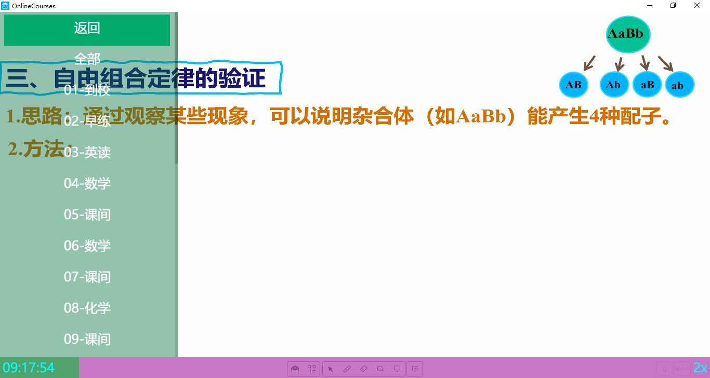

# OnlineCourses希沃在线课堂

## 简介

场景:

​	又因为调皮捣蛋被停课了?(没错就是我自己)

​	不方便到学校?

​	就是想躺在床上上课?

让OnlineCourses来解决这些问题!

班级一体机不断上传音频视频文件到阿里云盘,本地电脑下载并转码,最终通过前端应用程序享受线上课程!

Wonderful!

## 部署

在班级希沃电脑(或其他Win10一体机)和家中小电脑上分别部署程序.

### 希沃

1. 自行编译`server/`下程序或下载[Releases](https://github.com/yht0511/online-courses/releases)中已编译版本.

   编译:

   ```shell
   git clone https://github.com/yht0511/online-courses.git
   cd online-courses/server
   pip install -r requirements.txt # 安装依赖
   pip install pyinstaller
   pyinstaller -w -F main.py -i shell32_278.ico # 打包(程序输出到dist/)
   ```

2. 下载[aliyunpan](https://github.com/tickstep/aliyunpan/releases/tag/v0.2.7).

3. 将两个文件通过QQ/邮箱/SSH/U盘等方式传递到一体机上.

4. 将aliyunpan.exe所在目录添加到PATH.

   ```powershell
   setx path "%path%;目录路径"
   ```

5. [登录aliyunpan](https://github.com/tickstep/aliyunpan#%E5%9F%BA%E6%9C%AC%E4%BD%BF%E7%94%A8).

6. 添加启动项,让监控程序开机自启.

### 本地

推荐在Linux系统上部署.

```shell
apt install ffmpeg git python3 python-pip git -y # 安装必要的软件包
git clone https://github.com/yht0511/online-courses.git
cd online-courses
pip install -r requirements.txt # 安装依赖
mv aliyunpan /usr/bin/
aliyunpan login # 登录阿里云盘
nohup python3 main.py > oc.log &
```

## 效果



网页播放器支持:

1. 进度条及时间显示
2. 倍速播放(F键加速,S键减速)
3. 快进快退(左右箭头)
4. 隐藏侧边栏(减号隐藏,加号显示)
5. 分课程播放/整体播放

